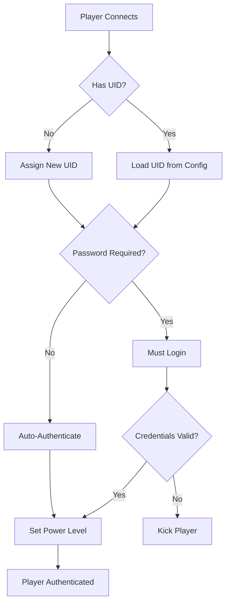

## Overview

CoD4 Unleashed uses a UID (User ID) based authentication system for player identification and admin management. This system provides more reliable player tracking than GUID-based systems and integrates with password-protected admin accounts.

<Note>
  UIDs are permanent numeric identifiers assigned to players. They are more reliable than GUIDs and support password authentication for administrators.
</Note>

## UID Authentication

### How UIDs Work

The UID system assigns each player a unique numeric identifier that persists across sessions:

- **UID Range:** Starts at 300,000,000 and increments
- **Format:** Integer value (e.g., 300123456)
- **Persistence:** Stored in server configuration
- **Display:** Prefixed with @ symbol (e.g., @300123456)

**Source:** `sv_auth.c:526`

### Authentication States

Players can have different authentication states:

| State | Value | Description |
|-------|-------|-------------|
| Authenticated | `1` | Successfully authenticated with server |
| Timed Out | `0` | Authentication server timeout |
| Plugin/N/A | `-1` | Plugin-based auth or not applicable |

**Source:** `sv_cmds.c:465-476`

### Player Identification

The server supports multiple ways to identify players:

**1. UID (Preferred)**
```bash
permban @300123456 Reason here
```

**2. GUID (PunkBuster)**
```bash
permban abc12345 Reason here
```

**3. Client Slot Number**
```bash
kick 5 Reason
```

**4. Player Name (Partial Match)**
```bash
kick Player Reason
```

<Warning>
  Name matching requires at least 3 characters to prevent accidental matches.
</Warning>

**Source:** `sv_cmds.c:116-240`

## Admin Management

### Admin Structure

The admin system supports up to **512 administrators** with the following attributes:

```c
typedef struct {
  char username[32];        // Admin login name
  char salt[129];          // Password salt
  char sha256[65];         // SHA-256 hashed password
  char sessionid[65];      // Web admin session ID
  int power;               // Power level (1-100)
  int uid;                 // Player UID
} authData_admin_t;
```

**Source:** `sv_auth.h:34-41`

### Power Levels

<ParamField path="power" type="integer" default="1">
  Admin power level from 1 to 100
  
  - **1-9:** Basic player/VIP
  - **10-34:** Junior moderators
  - **35-79:** Full moderators/admins
  - **80-94:** Senior admins
  - **95-100:** Super admins
</ParamField>

<Note>
  Each command has a minimum power requirement. Higher-power admins can execute more commands.
</Note>

### Adding Admins

#### AdminAddAdmin - UID-Based Admin

Add an admin using their existing UID (player must have connected before).

```bash
AdminAddAdmin <user> <power>
```

<ParamField path="user" type="string" required>
  Player identifier:
  - Online player name
  - Online player slot number
  - UID with @ prefix (e.g., @300123456)
</ParamField>

<ParamField path="power" type="integer" required>
  Power level between 1 and 100
</ParamField>

**Examples:**
```bash
AdminAddAdmin @300123456 80
AdminAddAdmin 5 50
AdminAddAdmin PlayerName 35
```

<Warning>
  This command is for high-privileged admins only. Don't create VIP accounts (non-admin) with power level 10 or higher.
</Warning>

**Source:** `sv_auth.c:198-272`

#### AdminAddAdminWithPassword - Password-Protected Admin

Create a new admin account with username/password authentication.

```bash
AdminAddAdminWithPassword <username> <password> <power>
```

<ParamField path="username" type="string" required>
  Login username for the admin (unique)
</ParamField>

<ParamField path="password" type="string" required>
  Password (minimum 6 characters)
</ParamField>

<ParamField path="power" type="integer" required>
  Power level between 1 and 100
</ParamField>

**Security features:**
- Passwords are hashed using SHA-256
- Random salt is generated for each account
- Session-based authentication for web admin

**Example:**
```bash
AdminAddAdminWithPassword john mypassword123 75
```

<Note>
  A new UID is automatically assigned to this admin account.
</Note>

**Source:** `sv_auth.c:277-352`

### Removing Admins

```bash
AdminRemoveAdmin <user>
```

<ParamField path="user" type="string" required>
  Admin name or UID with @ prefix
</ParamField>

**Examples:**
```bash
AdminRemoveAdmin john
AdminRemoveAdmin @300123456
```

**Source:** `sv_auth.c:355-389`

### Listing Admins

View all registered administrators.

```bash
AdminListAdmins
```

**Output format:**
```
------- BAdmins: -------
  1:   Name: john, Power: 75, UID: @300123456
  2:   Name: admin2, Power: 90, UID: @300234567
---------------------------------
```

**Required power:** 80

**Source:** `sv_auth.c:393-404`

## Password Management

### Changing Your Own Password

Admins can change their own passwords.

```bash
ChangePassword <oldPassword> <newPassword>
```

<ParamField path="oldPassword" type="string" required>
  Your current password
</ParamField>

<ParamField path="newPassword" type="string" required>
  New password (minimum 6 characters)
</ParamField>

**Example:**
```bash
ChangePassword myoldpass mynewsecurepass
```

<Note>
  This command can only be used from in-game admin system or RCON.
</Note>

**Source:** `sv_auth.c:484-521`

### Admin Password Reset

Super admins can reset other admins' passwords.

```bash
AdminChangePassword <user> <newPassword>
```

<ParamField path="user" type="string" required>
  Admin name or UID with @ prefix
</ParamField>

<ParamField path="newPassword" type="string" required>
  New password (minimum 6 characters)
</ParamField>

**Required power:** 95

**Example:**
```bash
AdminChangePassword @300123456 newpassword123
AdminChangePassword john resetpass456
```

**Source:** `sv_auth.c:463-482`

## Login System

### In-Game Login

Admins with password-protected accounts must login to access admin commands.

```bash
Login <loginname> <password>
```

<ParamField path="loginname" type="string" required>
  Admin username
</ParamField>

<ParamField path="password" type="string" required>
  Admin password
</ParamField>

**Example:**
```bash
Login john mypassword123
```

**Success output:**
```
Successfully authorized. UID: 300123456, name: john, power: 75
```

<Warning>
  Failed login attempts will kick the player from the server with "Incorrect login credentials" message.
</Warning>

**Source:** `sv_auth.c:589-630`

### Session Management

For web admin and RCON:

- Sessions use 64-character SHA-256 hashes
- Session IDs are stored temporarily for active users
- Sessions can be invalidated by password changes

**Source:** `sv_auth.c:59-94`

## Authorization Flow



## Command Power Requirements

### Setting Command Power Levels

Adjust the minimum power level required for any command.

```bash
AdminChangeCommandPower <command> <minpower>
```

<ParamField path="command" type="string" required>
  Command name (console commands only, not cvars)
</ParamField>

<ParamField path="minpower" type="integer" required>
  Minimum power level (1-100)
</ParamField>

**Required power:** 98

**Example:**
```bash
AdminChangeCommandPower kick 35
AdminChangeCommandPower permban 80
```

**Source:** `sv_auth.c:641-667`

### Default Command Powers

| Command | Default Power |
|---------|---------------|
| rules | 1 |
| kick | 35 |
| map_restart | 50 |
| AdminListAdmins | 80 |
| AdminAddAdmin | 95 |
| AdminChangePassword | 95 |
| AdminChangeCommandPower | 98 |

**Source:** `sv_cmds.c:1983-2000`, `sv_auth.c:684-691`

## Authorization Checks

### Power Level Enforcement

All privileged commands check the invoker's power level:

```c
int Auth_GetClPower(client_t* cl) {
  if (cl->uid < 1) return 1;
  if (cl->power > 1) return cl->power;
  return Auth_GetClPowerByUID(cl->uid);
}
```

**Source:** `sv_auth.c:801-807`

### Protection Against Abuse

<Warning>
  **Power Level Checks:**
  - Cannot kick/ban admins with equal or higher power
  - Cannot modify permissions above your own level
  - All commands validate invoker authority
</Warning>

**Example from kick command:**
```c
if (cl.cl->power > Cmd_GetInvokerPower() && Cmd_GetInvokerPower() > 1) {
  Com_Printf("Error: You cannot kick an admin with higher power!\n");
  return;
}
```

**Source:** `sv_cmds.c:1048-1051`

## Storage and Persistence

### Configuration Format

Admins are stored in the server configuration file using infostring format:

```
type\authAdmin\power\75\uid\300123456\password\<hash>\salt\<salt>\username\john\
```

**Fields stored:**
- `type`: Always "authAdmin"
- `power`: Power level
- `uid`: Player UID
- `password`: SHA-256 hash
- `salt`: Random salt
- `username`: Login name

**Source:** `sv_auth.c:695-721`

### Loading Admin Configuration

```c
qboolean Auth_InfoAddAdmin(const char* line) {
  power = atoi(Info_ValueForKey(line, "power"));
  uid = atoi(Info_ValueForKey(line, "uid"));
  Q_strncpyz(password, Info_ValueForKey(line, "password"), sizeof(password));
  Q_strncpyz(salt, Info_ValueForKey(line, "salt"), sizeof(salt));
  Q_strncpyz(username, Info_ValueForKey(line, "username"), sizeof(username));
  // ...
}
```

**Source:** `sv_auth.c:723-742`

## Best Practices

<CardGroup cols={2}>
  <Card title="Use Strong Passwords" icon="lock">
    Require passwords of at least 12 characters with mixed case, numbers, and symbols
  </Card>
  
  <Card title="Limit High Power Levels" icon="user-shield">
    Only grant power 95+ to fully trusted administrators
  </Card>
  
  <Card title="Regular Audits" icon="list-check">
    Periodically review admin list with `AdminListAdmins`
  </Card>
  
  <Card title="UID Preference" icon="fingerprint">
    Use UID-based identification over GUID when possible
  </Card>
</CardGroup>

## Related Topics

<CardGroup cols={2}>
  <Card title="Server Commands" icon="terminal" href="/admin/server-commands">
    Complete console command reference
  </Card>
  
  <Card title="Web Admin" icon="browser" href="/admin/web-admin">
    Web-based administration interface
  </Card>
  
  <Card title="Security Features" icon="shield" href="/admin/security">
    Banning system and server security
  </Card>
  
  <Card title="Configuration" icon="gear" href="/concepts/configuration">
    Configure server settings and cvars
  </Card>
</CardGroup>