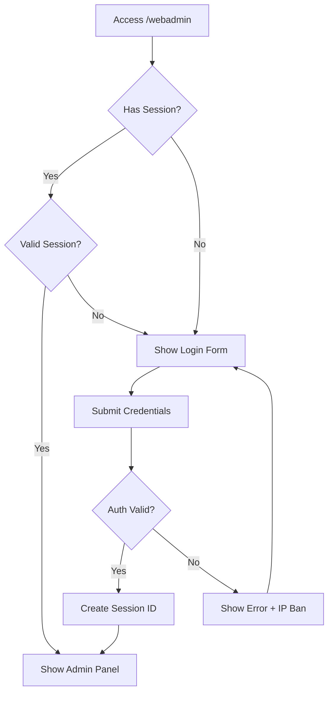

## Overview

CoD4 Unleashed includes a built-in web server that provides browser-based server administration. The web admin interface allows you to manage players, execute commands, and monitor server status from any web browser.

<Note>
  The web admin requires admin authentication with username and password. It uses session-based authentication with SHA-256 security.
</Note>

## Features

<CardGroup cols={2}>
  <Card title="Real-time Server Status" icon="server">
    View connected players with scores, ping, and team information
  </Card>
  
  <Card title="Console Command Execution" icon="terminal">
    Execute any server command remotely through the web interface
  </Card>
  
  <Card title="Player Management" icon="users">
    Kick and ban players directly from the web interface
  </Card>
  
  <Card title="Admin List" icon="shield-check">
    View all registered administrators and their power levels
  </Card>
</CardGroup>

## Accessing Web Admin

### Web Admin URL

The web admin is accessible at:

```
http://your-server-ip:port/webadmin
```

<Note>
  The port number depends on your HTTP server configuration. The default port is typically configured in your server setup.
</Note>

### Public Status Page

A public server status page is available without authentication:

```
http://your-server-ip:port/status
```

This displays:
- Current map name
- Connected players and their stats
- Team composition
- Ping and scores
- Short GUID (last 8 characters)

**Source:** `webadmin.c:718-724`

## Authentication

### Login System

The web admin uses session-based authentication with the following features:

- **Session IDs:** 64-character SHA-256 hashes
- **Password Security:** Salted SHA-256 password hashing
- **Brute Force Protection:** IP-based temporary bans after failed attempts
- **Automatic Logout:** Session management with logout capability

**Source:** `webadmin.c:796-844`, `sv_auth.c:80-94`

### Login Form

To access the web admin, you must login with admin credentials:

**Required credentials:**
- Username (created with `AdminAddAdminWithPassword`)
- Password (minimum 6 characters)

<Warning>
  Failed login attempts trigger a 10-second IP ban with the message "Invalid login attempt. You have to wait 20 seconds".
</Warning>

**Source:** `webadmin.c:582-605`, `webadmin.c:816-820`

### Login Flow



**Source:** `webadmin.c:796-844`

## Web Admin Interface

### Main Dashboard

After login, the main interface displays:

**Header:**
- Server version (CoD4U v1.7a / v1.8)
- Server hostname (with color codes rendered)
- Current map name
- Logged in username
- Logout link

**Two-column layout:**

**Left Column - Server Status:**
- Real-time player list
- Team organization (Axis/Allies/Spectators)
- Client ID, Name, UID/GUID, Power, Score, Ping

**Right Column - Command Console:**
- Command input form
- Command execution output
- Quick action buttons

**Source:** `webadmin.c:629-716`

### Server Status View

Detailed player information table:

```html
CID | Name | UID/GUID | Power | Score | Ping
----|------|----------|-------|-------|-----
 0  | Player1 | @300123456 | 75 | 2500 | 45
 1  | Player2 | abc12345   | 1  | 1200 | 30
```

**Displays:**
- Client ID (slot number)
- Player name with color code rendering
- UID (if authenticated) or GUID
- Admin power level
- Current score
- Ping in milliseconds

**Team-based organization:**
- For team gametypes, players are grouped by team
- Team names (Axis: Opfor/Spetsnaz, Allies: Marines/S.A.S.)
- Spectators listed separately

**Source:** `webadmin.c:181-438`

### Console Command Interface

Execute server commands remotely:

**Form fields:**
- Text input for command
- "Send Command" button
- Command output display area

**Command execution:**
```javascript
POST /webadmin?action=sendcmd
consolecommand=<your command>
```

<Note>
  Commands are executed with the logged-in admin's power level. Insufficient permissions will be rejected.
</Note>

**Security features:**
- Command power level validation
- Separator character filtering (`;`, `\n`, `\r`)
- Maximum command length: 960 characters
- Buffer overflow protection

**Source:** `webadmin.c:521-580`, `webadmin.c:686-694`

## Player Management

### Kick Player

Kick a player via web interface:

**HTTP Request:**
```
POST /webadmin?action=kickclient
cid=<client_id>&reason=<reason>
```

<ParamField path="cid" type="integer" required>
  Client slot number (0-63)
</ParamField>

<ParamField path="reason" type="string">
  Kick reason (defaults to "The admin has no reason given")
</ParamField>

**Required power:** Same as `kick` command

**Source:** `webadmin.c:440-462`, `webadmin.c:703-704`

### Ban Player

Permanently ban a player:

**HTTP Request:**
```
POST /webadmin?action=banclient
cid=<client_id>&reason=<reason>
uid=<uid>&reason=<reason>
guid=<guid>&reason=<reason>
```

<ParamField path="cid" type="integer">
  Client slot number for online player
</ParamField>

<ParamField path="uid" type="integer">
  Player UID for offline ban
</ParamField>

<ParamField path="guid" type="string">
  Player GUID (32 characters) for offline ban
</ParamField>

<ParamField path="reason" type="string" required>
  Ban reason (required)
</ParamField>

**Required power:** Same as `permban` command

<Warning>
  Ban actions are permanent and also create IP bans for additional enforcement.
</Warning>

**Source:** `webadmin.c:464-503`, `webadmin.c:700-701`

## Admin List View

View registered administrators:

**URL:**
```
http://your-server-ip:port/webadmin/listadmins
```

**Displays:**
- Admin username (with color codes)
- UID
- Power level

**Required power:** Same as `AdminListAdmins` command (typically 80)

**Example table:**
```
Name     | UID        | Power
---------|------------|------
SuperAdmin | @300123456 | 100
Moderator  | @300234567 | 75
Helper     | @300345678 | 50
```

**Source:** `webadmin.c:123-163`, `webadmin.c:655-657`

## Color Code Rendering

The web admin renders CoD4 color codes as HTML:

**Color code mapping:**
```c
char* htmlq3colors[] = {
  "#000000",  // ^0 - Black
  "#FF0000",  // ^1 - Red
  "#00FF00",  // ^2 - Green
  "#FFFF00",  // ^3 - Yellow
  "#0000FF",  // ^4 - Blue
  "#00FFFF",  // ^5 - Cyan
  "#FF00FF",  // ^6 - Magenta
  "#A0A0A0",  // ^7 - White/Gray
  "#7B8FB0",  // ^8 - Custom Blue
  "#A69169"   // ^9 - Custom Brown
};
```

**HTML output:**
```html
<span style="color: #FF0000">Red Text</span>
```

**Source:** `webadmin.c:25-66`

## Static Files

The web admin serves static assets from:

```
/webadmindata/
```

**Common files:**
- `webadmin.css` - Stylesheet
- Bootstrap CSS (referenced in HTML)

**Access:**
```
http://your-server-ip:port/files/webadmin.css
```

<Note>
  Static file paths are validated to prevent directory traversal attacks. Paths containing `..` or `::` are rejected.
</Note>

**Source:** `webadmin.c:759-777`

## API Reference

### URL Actions

The web admin supports these query string actions:

| Action | Method | Description |
|--------|--------|-------------|
| `sendcmd` | POST | Execute console command |
| `logout` | GET | End admin session |
| `banclient` | POST | Ban a player |
| `kickclient` | POST | Kick a player |
| `listadmins` | GET | View admin list |

**Source:** `webadmin.c:686-706`

### POST Data Format

The web admin uses URL-encoded form data:

```
Content-Type: application/x-www-form-urlencoded

username=admin&password=mypass
consolecommand=status
cid=5&reason=Teamkilling
```

**Utility functions:**
- `Webadmin_GetPostVal()` - Extract POST values
- `Webadmin_GetUrlVal()` - Extract URL parameters
- `HTTP_DecodeURLFormData()` - Decode URL encoding

**Source:** `webadmin.c:69-121`

## Security Features

### Session Security

<CardGroup cols={2}>
  <Card title="SHA-256 Sessions" icon="key">
    Session IDs are 64-character SHA-256 hashes generated from random data
  </Card>
  
  <Card title="Session Validation" icon="shield-check">
    All requests validate session ID against stored admin sessions
  </Card>
  
  <Card title="Logout Support" icon="right-from-bracket">
    Sessions can be invalidated with explicit logout action
  </Card>
  
  <Card title="IP Ban Protection" icon="ban">
    Failed login attempts trigger temporary IP bans
  </Card>
</CardGroup>

**Source:** `sv_auth.c:59-94`, `webadmin.c:698-699`

### Command Injection Prevention

**Security measures:**
1. Command separator filtering (`;`, `\n`, `\r`)
2. Maximum command length (960 chars)
3. Power level validation before execution
4. No shell access - commands executed internally

```c
Q_strchrrepl(buffer, ';', '\0');
Q_strchrrepl(buffer, '\n', '\0');
Q_strchrrepl(buffer, '\r', '\0');
```

**Source:** `webadmin.c:542-544`

### Directory Traversal Prevention

Static file access is protected:

```c
if (strstr(qpath, "..") != NULL || strstr(qpath, "::") != NULL) {
  return qfalse;  // Reject request
}
```

**Source:** `webadmin.c:765-767`

## Response Format

The web admin generates HTML responses:

**HTML structure:**
```html
<!DOCTYPE html>
<html>
<head>
  <title>CoD4X Web Server</title>
</head>
<body>
  <div class="container">
    <div class="page-header">
      <h1>CoD4U v1.8 <small>Web Server</small></h1>
      <h3>[Server Name] [Map Name]</h3>
    </div>
    <!-- Content -->
  </div>
</body>
</html>
```

**Source:** `webadmin.c:619-648`

## Message Building

The web admin uses XML-style helpers for HTML generation:

**Macros:**
- `XO(tag)` - Open tag
- `XC` - Close tag
- `XA(text)` - Append text
- `XO1(tag, attr, val)` - Open tag with attribute

**Example:**
```c
XO1("table", "class", "table table-striped");
  XO("tr");
    XO("td");
      XA("Player Name");
    XC;
  XC;
XC;
```

**Source:** `webadmin.c:12-23`

## Configuration

### Server Hostname Display

The web admin displays your configured server hostname:

```c
XA(Webadmin_ConvertToHTMLColor(sv_hostname->string, colorbuf, sizeof(colorbuf)));
```

**Source:** `webadmin.c:642-643`

### Network Address

The footer displays your server's network address:

```c
XA("Net: ");
XA(NET_GetHostAddress(netadrstr, sizeof(netadrstr)));
```

**Source:** `webadmin.c:737-738`

## Best Practices

<CardGroup cols={2}>
  <Card title="Strong Passwords" icon="lock">
    Use passwords with minimum 12 characters, mixed case, and symbols
  </Card>
  
  <Card title="Limit Access" icon="user-lock">
    Only grant web admin access to trusted administrators
  </Card>
  
  <Card title="HTTPS Recommended" icon="shield-halved">
    Use reverse proxy with HTTPS for production environments
  </Card>
  
  <Card title="Regular Monitoring" icon="eye">
    Review web admin access logs for suspicious activity
  </Card>
</CardGroup>

## Related Topics

<CardGroup cols={2}>
  <Card title="Authentication System" icon="shield-check" href="/admin/authentication">
    UID system and admin account management
  </Card>
  
  <Card title="Server Commands" icon="terminal" href="/admin/server-commands">
    Complete console command reference
  </Card>
  
  <Card title="Security Features" icon="shield" href="/admin/security">
    Server security and ban management
  </Card>
  
  <Card title="Configuration" icon="gear" href="/concepts/configuration">
    Server configuration and settings
  </Card>
</CardGroup>